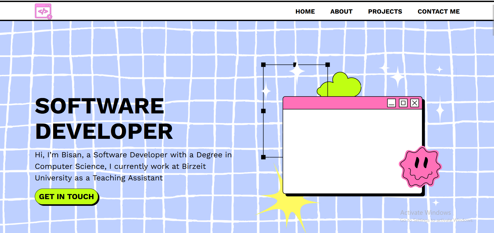

# Neo-Brutalist Portfolio  

This is my personal portfolio website, created as part of my internship at Foothill Technology Solutions (FTS). It showcases my projects, skills, and experience in software development.  

🔗 **Live Demo**: [Visit My Portfolio](https://bisanghoul.github.io/portfolio/)

## Table of Contents  

- [Overview](#overview)  
- [Features](#features)  
- [Technologies Used](#technologies-used)  
- [Setup](#setup)
  
## Overview  

This portfolio follows a **neo-brutalist design style**, characterized by bold colors, sharp contrasts, and structured elements. It serves as an interactive resume, displaying my background, skills, and projects.

## Features  

- **Live Hosted Website**: Accessible online for easy viewing.  
- **Responsive Navigation**: A mobile-friendly navigation menu with a toggle button.  
- **Project Showcase**: Displays a list of my software development projects with descriptions and images.  
- **Skills Section**: Highlights my technical skills using visually distinct badges.  
- **Contact Form**: A functional contact form integrated with [Formspree](https://formspree.io/).  
- **Accessibility**: Follows best practices for accessibility, including ARIA attributes and semantic HTML.  

## Technologies Used  

- **Frontend**: HTML, CSS, JavaScript  
- **Design**: CSS variables and flexbox/grid for layout styling  
- **Icons & Fonts**: Google Fonts (`Lexend Mega`, `Work Sans`), custom SVG icons  
- **Hosting**: GitHub Pages

## Setup  

1. Clone the repository:  
   ```sh
   git clone https://github.com/BisanGhoul/your-portfolio-repo.git
   cd your-portfolio-repo
